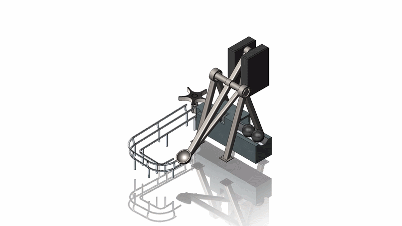
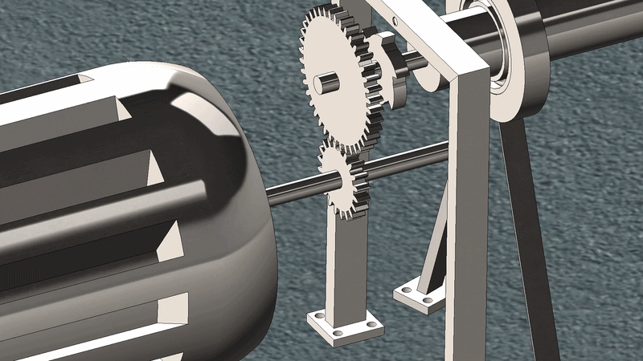
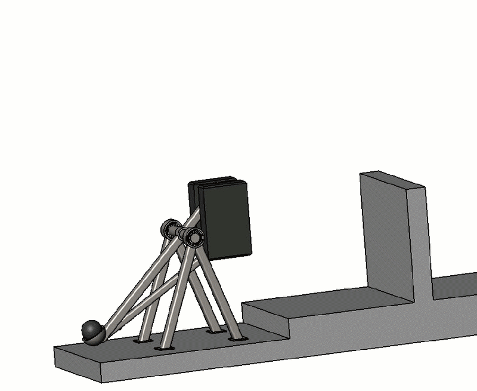

# Autonomous Loading Catapult in SolidWorks

This repository presents the design, 3D modeling, and structural analysis of an Autonomous Loading Catapult. Developed as a team project for our university coursework, this modified trebuchet design features fully automated mechanisms for loading, tensioning, and firing projectiles.

## Motions

## Subassemblies

### 1\. Mechanical System

The mechanical system is responsible for the actual launching of the projectile. It utilizes a heavy counterweight mechanism to forcefully swing the arm upwards and propel the projectile towards its target once the trigger is released.

<table>

&#x20; <thead>

&#x20;   <tr>

&#x20;     <th>Part Name</th>

&#x20;   </tr>

&#x20; </thead>

&#x20; <tbody>

&#x20;   <tr><td>Arm</td></tr>

&#x20;   <tr><td>Arm support</td></tr>

&#x20;   <tr><td>Counterweight</td></tr>

&#x20; </tbody>

</table>

### 2\. Loading System

This system features a storage structure and a track with a constant 5-degree inclination that allows loading the projectile from the most stable side of the catapult. A motorized gear controls the release of the projectiles into the tubular circuit, guiding them smoothly into the catapult's pouch from the lowest possible position to ensure precision and effectiveness.

<table>

&#x20; <thead>

&#x20;   <tr>

&#x20;     <th>Part Name</th>

&#x20;   </tr>

&#x20; </thead>

&#x20; <tbody>

&#x20;   <tr><td>Sheet metal track</td></tr>

&#x20;   <tr><td>Gear shaft</td></tr>

&#x20;   <tr><td>Projectile support</td></tr>

&#x20;   <tr><td>Gear</td></tr>

&#x20;   <tr><td>Structural member</td></tr>

&#x20;   <tr><td>Motor</td></tr>

&#x20;   <tr><td>Transition track</td></tr>

&#x20;   <tr><td>Projectile</td></tr>

&#x20; </tbody>

</table>

### 3\. Tensioning System

This is a motorized set of elements that makes the tensioning of the catapult possible for its subsequent loading. Driven by a motor and a 1:2 ratio gear reduction system, it winds a rope around a shaft to pull the catapult arm back down. It also features a ratchet and trigger mechanism to prevent accidental release during the tensioning process.

<table>

&#x20; <thead>

&#x20;   <tr>

&#x20;     <th>Part Name</th>

&#x20;   </tr>

&#x20; </thead>

&#x20; <tbody>

&#x20;   <tr><td>Large gear</td></tr>

&#x20;   <tr><td>Small gear</td></tr>

&#x20;   <tr><td>Trigger</td></tr>

&#x20;   <tr><td>Ratchet</td></tr>

&#x20;   <tr><td>Motor</td></tr>

&#x20;   <tr><td>Shaft</td></tr>

&#x20;   <tr><td>Support</td></tr>

&#x20;   <tr><td>Trigger support</td></tr>

&#x20; </tbody>

</table>

### 4\. Pulley System

A fundamental component of the tensioning process. Anchored securely to the ground base, it routes the rope from the tensioning system's shaft to the hook on the catapult's arm, providing the necessary mechanical alignment to safely pull the arm down against the weight of the counterweight.

<table>

&#x20; <thead>

&#x20;   <tr>

&#x20;     <th>Part Name</th>

&#x20;   </tr>

&#x20; </thead>

&#x20; <tbody>

&#x20;   <tr><td>Base</td></tr>

&#x20;   <tr><td>Support shaft</td></tr>

&#x20;   <tr><td>Support</td></tr>

&#x20;   <tr><td>Pulley</td></tr>

&#x20;   <tr><td>Pulley fastener</td></tr>

&#x20; </tbody>

</table>

### 5\. Other Components \& Final Assembly

These are the final individual components and the complete assembly of the catapult uniting all the aforementioned systems.

<table>

&#x20; <thead>

&#x20;   <tr>

&#x20;     <th>Part Name</th>

&#x20;   </tr>

&#x20; </thead>

&#x20; <tbody>

&#x20;   <tr><td>Hook</td></tr>

&#x20;   <tr><td>Ground base</td></tr>

&#x20;   <tr><td>Sensor</td></tr>

&#x20;   <tr><td>Mechanical System</td></tr>

&#x20;   <tr><td>Loading System</td></tr>

&#x20;   <tr><td>Tensioning System</td></tr>

&#x20;   <tr><td>Pulley</td></tr>

&#x20; </tbody>

</table>

## Finite Element Analysis (FEA)

Once the design was completed, the structural integrity of the system was thoroughly evaluated using a Finite Element Analysis (FEA). The primary objective, dictated by the structural requirements, was to ensure that the catapult's frame could safely support its own static weight plus 1.5 times the weight of the projectile (150 kg) while maintaining a strict minimum safety factor of 2.

A structural integrity evaluation was performed on the main frame of the catapult, which is the most stressed part of the system where the weights of the projectile and counterweight act.

### Material Selection

To achieve a balance between high rigidity (Young's modulus) and good toughness (impact resistance) without prohibitive costs, the structure was designed using AISI 4130 Steel normalized at 870ºC.

### Boundary Conditions \& Loads

* The bases of the four legs were fixed (encastred).
* Gravity was applied.
* A vertical downward force of 1500 N (equivalent to 1.5 times the 100 kg projectile weight) was applied to the "spoon".

### Results

* **Stress**: The system presented a maximum Von Mises stress of 266.4 MPa located specifically at the bearings. Excluding the bearings, the maximum stress on the main structure (specifically on the bar perpendicular to the main arm) was 40.1 MPa.

* **Factor of Safety**: Based on the localized stresses at the bearings, the real safety factor ranges between 1.727 and 5.111, which reasonably satisfies the project goal of an FS of 2.0.

* **Displacement**: The maximum vertical displacement occurred at the tip of the arm (spoon), measuring 3.521 mm upwards. The opposite end (counterweight) displaced -2.317 mm downwards. While this exceeds the strict 1.0 mm goal, the design is highly adequate given the extreme demands and the cost-minimization constraints.

